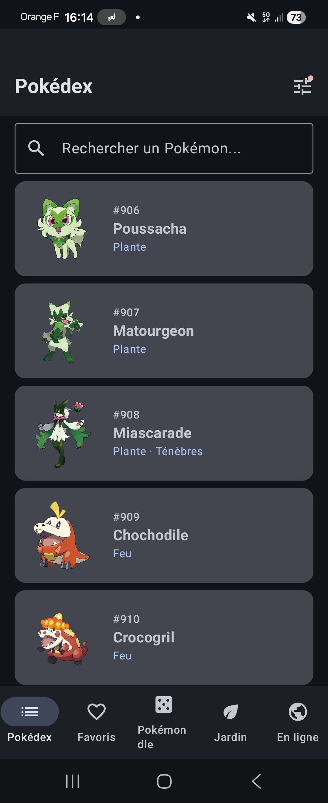
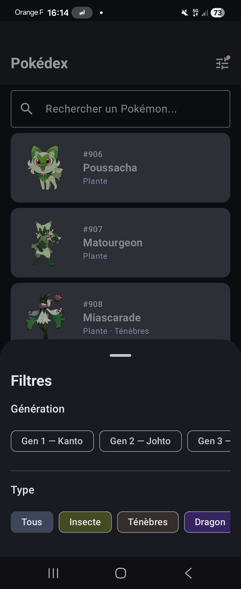
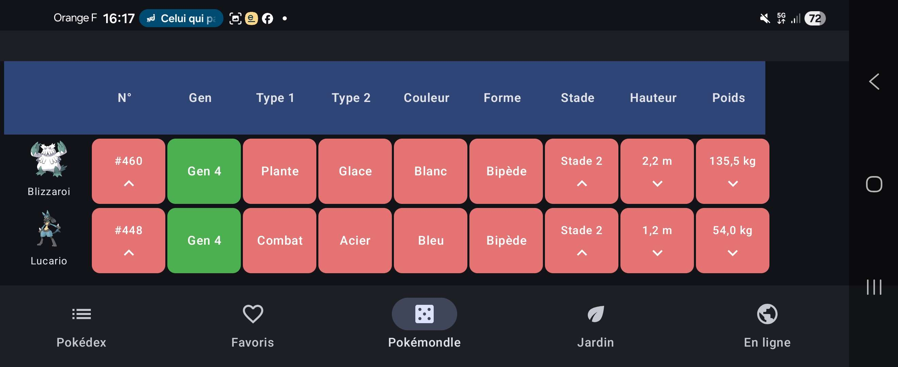
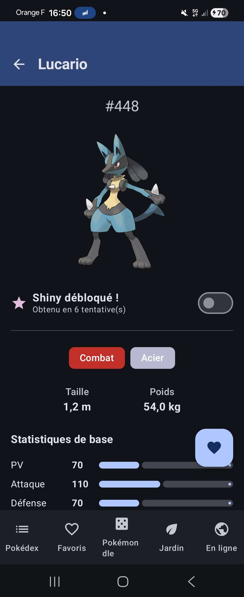
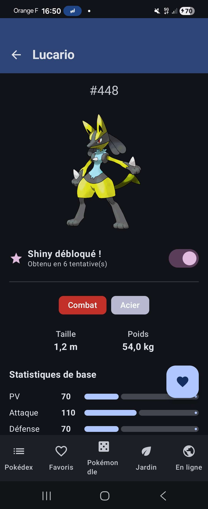
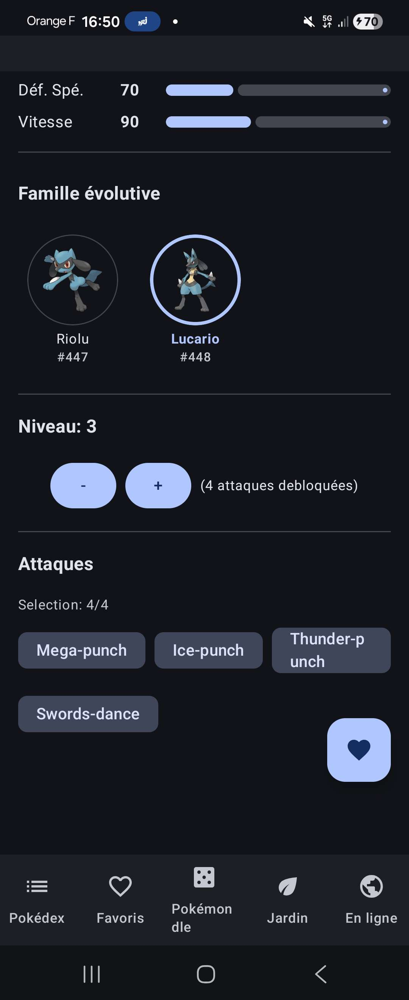
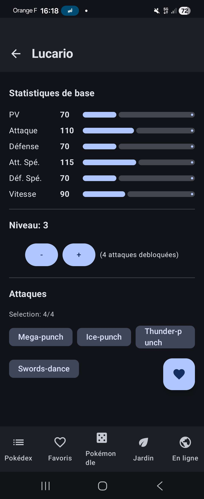
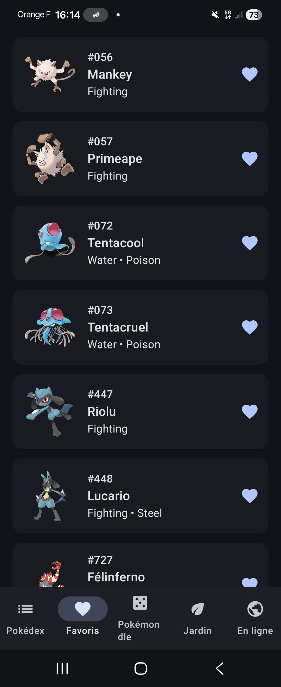
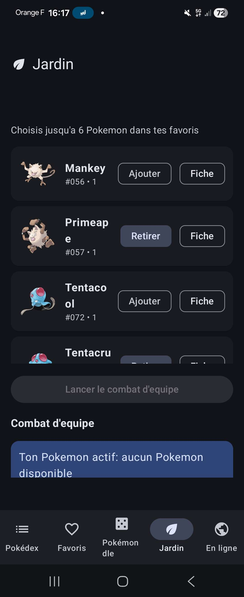
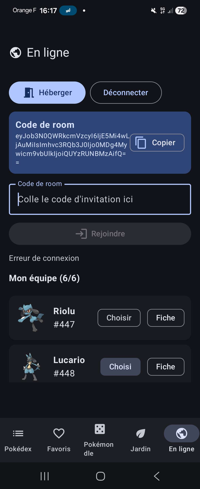

# PokéDex App — Atelier Développement Mobile (EPSI)

Application Android native en Kotlin consommant l'API publique [PokéAPI](https://pokeapi.co) pour afficher un Pokédex interactif avec gestion de favoris persistés localement.

> **Projet réalisé dans le cadre du cours de Développement Mobile à l'EPSI.**

---

## Sommaire

- [Fonctionnalités](#fonctionnalités)
- [Stack technique](#stack-technique)
- [Architecture](#architecture)
- [Structure du projet](#structure-du-projet)
- [Installation et lancement](#installation-et-lancement)
- [Captures d'écran](#captures-décran)
- [Difficultés rencontrées](#difficultés-rencontrées)
- [Auteur](#auteur)

---

## Fonctionnalités

### Pokédex (onglet principal)
- [x] **1025 Pokémons** organisés par **génération** (Gen 1 Kanto → Gen 9 Paldea)
- [x] **Noms en français** chargés depuis un asset local (Bulbizarre, Salamèche, Carapuce…)
- [x] Recherche par nom **insensible à la casse et aux accents** (tape "elec" → trouve "Électrik")
- [x] Filtres **Génération + Type** dans une **ModalBottomSheet** (gain d'espace en paysage)
- [x] Chips de type aux **couleurs iconiques** Bulbapedia (Feu rouge, Eau bleu, Plante vert…)
- [x] Fiche détaillée : sprite officiel, types colorés FR, taille, poids, 6 stats avec barres
- [x] **Famille évolutive** affichée sur chaque fiche (sprites en cercle, Pokémon courant mis en évidence)
- [x] **Système shiny** avec déblocage aléatoire (1/10 par visite) + **toggle on/off** une fois débloqué
- [x] TopAppBar collapsable au scroll

### Pokémondle (3ème onglet — mini-jeu façon Wordle)
- [x] Tire un Pokémon mystère parmi les **1025**
- [x] Autocomplétion sur les noms FR
- [x] Grille **10 colonnes** par tentative : sprite + n° + gen + 2 types + couleur + forme + stade + h + p
- [x] Cellules colorées : 🟢 égal, 🟠 type au mauvais slot, 🔴 différent + flèches ↑/↓ pour les +/-
- [x] **5 indices progressifs** (cooldown 5 essais) : Gen → Couleur → Type 1 → 1re lettre → Silhouette
- [x] **Pénalité** : chaque indice utilisé ajoute 2 tentatives au score final
- [x] Bouton **"Je ne sais pas"** pour passer à un autre Pokémon
- [x] Suivi du **win streak** 🔥 (série de victoires consécutives)

### Favoris + Jardin + En ligne (Pierre)
- [x] **Favoris** persistés localement via Room avec Flow réactif (FAB sur la fiche détail)
- [x] **Jardin** : système de combat tour par tour avec équipe choisie depuis les favoris
- [⚠️] **En ligne** : mode PvP encore en chantier au moment de la livraison

### Architecture
- [x] **MVVM + Clean Architecture** strictes en 3 couches (mandatoire par le sujet)
- [x] **Hilt** pour l'injection de dépendances, **Room** pour la persistance
- [x] **5 onglets** dans la Bottom Navigation : Pokédex · Favoris · Pokémondle · Jardin · En ligne

---

## Stack technique

| Catégorie | Librairie | Rôle |
|---|---|---|
| **Langage** | Kotlin | Langage principal |
| **UI** | Jetpack Compose + Material 3 | Construction des écrans |
| **Architecture** | MVVM + Clean Architecture | Séparation des responsabilités |
| **DI** | Hilt | Injection de dépendances |
| **Réseau** | Retrofit + OkHttp + Logging Interceptor | Consommation de l'API REST |
| **Sérialisation** | Gson (ou Moshi) | Parsing JSON ↔ objets Kotlin |
| **Images** | Coil | Chargement asynchrone des sprites |
| **Base de données** | Room | Persistance des favoris |
| **Asynchrone** | Coroutines + Flow / StateFlow | Programmation réactive |
| **Navigation** | Jetpack Navigation Compose | Navigation entre écrans |

### Versions et environnement

- **Android Studio** : 2025.3.4 (Narwhal)
- **Android Gradle Plugin** : 8.7.3
- **Kotlin** : 2.0.21
- **KSP** : 2.0.21-1.0.28
- **Hilt** : 2.52
- **Room** : 2.6.1
- **Retrofit** : 2.11.0
- **Coil** : 2.7.0
- **Navigation Compose** : 2.8.5
- **Compose BOM** : 2024.12.01
- **Compile SDK** : 35
- **Min SDK** : 24 (Android 7.0 Nougat)
- **Target SDK** : 35
- **Java target** : 11

---

## Architecture

Le projet suit le pattern **MVVM** combiné à une **Clean Architecture** en 3 couches, comme imposé par le cahier des charges.

```
┌─────────────────────────────────────────┐
│           PRESENTATION (UI)             │
│   Composables + ViewModels + StateFlow  │
└──────────────────┬──────────────────────┘
                   │ observe
┌──────────────────▼──────────────────────┐
│              DOMAIN                     │
│   Models + Repository interfaces +      │
│              UseCases                   │
└──────────────────┬──────────────────────┘
                   │ implémenté par
┌──────────────────▼──────────────────────┐
│               DATA                      │
│   Retrofit API + Room DB + Repository   │
│             implementations             │
└─────────────────────────────────────────┘
```

### Choix architecturaux justifiés

- **MVVM** : séparation entre l'UI (Compose) et la logique de présentation (ViewModels). Permet aux ViewModels de survivre aux rotations d'écran et d'être testables sans le framework Android.
- **Clean Architecture** : la couche `domain` ne dépend d'aucun framework, ce qui la rend portable et facilement testable. Les `UseCases` encapsulent les règles métier réutilisables.
- **Repository pattern** : abstraction des sources de données (réseau + BDD locale). L'interface vit en `domain/`, l'implémentation en `data/`, permettant un swap facile (mock pour les tests, par exemple).
- **Hilt** : génère le code d'injection de dépendances à la compilation, plus performant que Dagger pur et bien intégré à Android.
- **StateFlow** : exposition d'états UI immuables et observables côté Compose, parfait pour le pattern unidirectionnel data flow.
- **Sealed class `UiState<T>`** : modélise explicitement les trois états possibles d'une opération asynchrone (Loading / Success / Error) et force l'UI à les gérer tous.

---

## Structure du projet

```
com.example.pokedex/
├── data/
│   ├── remote/        ← Retrofit API + DTOs (Pokemon, Species, EvolutionChain)
│   ├── local/         ← Room Entities, DAOs, PokemonNameLocalizer (FR asset)
│   ├── cache/         ← PokemonCache (mémoire)
│   ├── preload/       ← PreloadManager (precharge en arrière-plan)
│   ├── online/        ← Protocole PvP (Pierre)
│   └── repository/    ← Implémentations des repositories
├── domain/
│   ├── model/         ← Pokemon, PokemonDetail, PokemonGameData, Generation,
│   │                    CellComparison, GuessResult, HintType…
│   ├── battle/        ← Moteurs de combat tour par tour (Pierre)
│   ├── repository/    ← Interfaces (PokemonRepository, GameRepository, FavoriteRepository)
│   └── usecase/       ← Use cases (GetPokemonList, StartNewGame, ValidateGuess…)
├── presentation/
│   ├── list/          ← Écran Pokédex + ViewModel + filtres
│   ├── detail/        ← Fiche détail Pokémon + ViewModel
│   ├── favorites/     ← Liste favoris + ViewModel
│   ├── game/          ← Pokémondle : screen, ViewModel, GuessGrid, HintPanel
│   ├── garden/        ← Système de combat (Pierre)
│   ├── online/        ← Mode PvP (Pierre)
│   ├── common/        ← UiState, PokemonTypeStyling (FR + couleurs)
│   └── navigation/    ← AppNavigation (5 onglets)
├── di/                ← Modules Hilt (NetworkModule, PokemonRepositoryModule,
│                        GameRepositoryModule, FavoriteRepositoryModule)
└── ui/theme/          ← Thème Material 3
```

### Asset embarqué

- `app/src/main/assets/fr_names.json` (~18 KB) — map id Pokémon → nom français pour les 1025 Pokémons. Généré une fois depuis PokéAPI (endpoint `/pokemon-species/{id}`) puis embarqué dans l'APK pour éviter 1025 appels réseau au démarrage.

---

## Installation et lancement

### Prérequis
- Android Studio Narwhal (2025.3+) ou plus récent
- JDK 11 ou supérieur
- Un émulateur Android API 26+ ou un appareil physique en mode développeur

### Étapes

1. Cloner le dépôt :
   ```bash
   git clone <url-du-repo>
   cd "developpement mobile"
   ```
2. Ouvrir le dossier dans Android Studio.
3. Laisser Gradle synchroniser les dépendances (peut prendre quelques minutes au premier build).
4. Sélectionner un device/émulateur dans la barre du haut.
5. Cliquer sur **Run** (▶) ou `Shift + F10`.

### Build de l'APK debug

```bash
./gradlew assembleDebug
```

L'APK sera généré dans `app/build/outputs/apk/debug/app-debug.apk`.

Sous Windows, tu peux aussi utiliser le script racine :

```bat
build-apk.bat
```

Ce script lance uniquement `:app:assembleDebug` et ne déclenche aucun test.

Pour installer directement l'application sur un émulateur ou un appareil connecté :

```bat
install-apk.bat
```

Ce script lance uniquement `:app:installDebug` et ne déclenche aucun test.

---

## Captures d'écran

### Pokédex — onglet principal

| Liste avec noms FR + types colorés | Filtres dans une bottom sheet |
|---|---|
|  |  |

Les **chips de type** reprennent les couleurs iconiques Bulbapedia (Feu rouge, Plante vert, etc.). Le filtre **Génération + Type** est rangé dans une **ModalBottomSheet** déclenchée par l'icône `Tune` de la TopAppBar — gain massif d'espace, surtout en paysage. Un badge apparaît sur l'icône si au moins un filtre est actif.

### Pokémondle — mini-jeu façon Wordle

| Partie en cours |
|---|
|  |

Grille de tentatives **10 colonnes** comparant chaque guess à la cible mystère (sprite, n°, génération, types, couleur, forme, stade d'évolution, hauteur, poids). Code couleur vert/orange/rouge, flèches ↑/↓ pour les valeurs numériques. L'autocomplétion gère les **noms FR** (insensible aux accents — tape "elec" trouve "Électrik"). Badge **🔥 N** dans la TopAppBar pour le suivi de la série de victoires.

### Fiche détail — types colorés FR + ligne évolutive + toggle shiny

| Sprite normal | Sprite shiny (toggle ON) | Avec famille évolutive |
|---|---|---|
|  |  |  |

Types affichés en **français** (Plante, Eau, Feu…) avec leurs **couleurs iconiques** Bulbapedia. Les 6 stats apparaissent en barres de progression. Le **FAB** en bas à droite bascule l'état favori.

**Système shiny** (Pierre) : chaque visite tente un encounter shiny (1/10). Une fois débloqué, l'utilisateur peut **activer/désactiver l'affichage** via un Switch — le sprite normal et le sprite shiny restent tous les deux disponibles, on choisit lequel afficher.

**Famille évolutive** : récupérée via `/pokemon-species` + `/evolution-chain` puis aplatie en liste ordonnée. Affichage en cercles avec sprite officiel, nom FR et n° Pokédex. Le Pokémon courant est mis en évidence (bordure plus épaisse + nom en gras). Gère les chaînes simples (Bulbi → Herbi → Florizarre), branchues (Évoli + 8 évolutions) et solo (section masquée).

### Autre fiche détail



### Onglets bonus (partie Pierre)

| Favoris | Jardin (combat) | En ligne (WIP) |
|---|---|---|
|  |  |  |

Le mode **En ligne** (PvP) est marqué comme non fonctionnel à la livraison — backend Socket pas finalisé.

---

## Difficultés rencontrées

### 1. Incompatibilité AGP 9.x ↔ Hilt 2.x
Android Studio Narwhal (2025.3) installe par défaut **AGP 9.2.1**, qui a supprimé l'API interne `BaseExtension` utilisée par le plugin Gradle de Hilt. Conséquence : aucune version de Hilt (testées jusqu'à 2.57) ne parvient à s'appliquer, le build échouant avec `Android BaseExtension not found`.

**Solution** : downgrade contrôlé de la chaîne d'outils vers une combinaison stable et largement compatible — AGP **8.7.3** + Kotlin **2.0.21** + Hilt **2.52** + KSP **2.0.21-1.0.28**. Le `compileSdk` est passé de 36 à 35 pour rester aligné avec AGP 8.x.

### 2. Pollution de l'historique Git par l'installateur Android Studio
L'installeur `android-studio-panda4-patch1-windows.exe` (1.36 GB) s'est retrouvé commit lors du `git init` initial faute d'avoir été ajouté au `.gitignore`. Le `git push` initial a refusé d'avancer (GitHub limite les fichiers à 100 MB).

**Solution** : `git filter-branch --index-filter "git rm --cached --ignore-unmatch ..."` pour réécrire l'historique et purger le binaire de tous les commits, suivi de `git gc --prune=now --aggressive` pour libérer l'espace. Patterns `*.exe`, `*.msi`, `premiercours/` ajoutés au `.gitignore` pour éviter une rechute.

### 3. Coordination en binôme sans Pull Request
Le workflow choisi étant la fusion directe dans `main` sans PR, plusieurs ajustements ont dû être faits côté code à la phase d'intégration :
- Use cases favoris (`GetFavoritesUseCase`, `ToggleFavoriteUseCase`, `IsFavoriteUseCase`) initialement absents — ajoutés pendant l'intégration pour respecter la Clean Architecture.
- Refacto de `FavoritesViewModel` pour qu'il dépende d'un UseCase plutôt que directement du `FavoriteRepository`.
- L'en-tête de licence Apache 2.0 supprimé par mégarde du `gradlew.bat` a été restauré.

**Leçon** : même sans PR, communiquer les contrats domain en amont (interfaces, modèles) est crucial pour éviter les conflits d'intégration.

### 4. PokéAPI ne renvoie pas les types dans le endpoint liste
`GET /pokemon?limit=100` ne renvoie que `{ name, url }`. Impossible d'afficher les types et le sprite dans la liste sans un second appel par Pokémon.

**Solution** : 101 appels HTTP en parallèle via `coroutineScope { ... .map { async { api.getPokemonDetail(it) } }.awaitAll() }`. Le temps total reste équivalent à la requête la plus lente (~1-2 s) au lieu de la somme cumulée (~30 s en séquentiel).

### 5. TopAppBar trop encombrante en mode paysage
En paysage, l'en-tête Material 3 + champ de recherche + chips de type prenaient ~70 % de la hauteur, ne laissant visible qu'une ligne de Pokémon.

**Solution** : `TopAppBarDefaults.enterAlwaysScrollBehavior()` couplé à `Modifier.nestedScroll(...)` sur le Scaffold. La TopAppBar se replie automatiquement quand l'utilisateur scrolle vers le bas et réapparaît au scroll inverse. UX uniforme sur portrait et paysage.

### 6. Subtilité `runCatching` vs `Result` propre
`runCatching` de Kotlin capture toutes les exceptions, y compris `CancellationException` qui est le mécanisme interne d'annulation des coroutines. Capturer cette exception casse silencieusement l'annulation.

**Solution** : helper `safeApiCall` dans `PokemonRepositoryImpl` qui rejette explicitement `CancellationException` avant de wrapper les autres erreurs dans `Result.failure`.

---

## Auteurs

Projet réalisé en binôme :
- **Alexandre S.**
- **Pierre**

## Répartition des tâches

| Membre | Responsabilités |
|---|---|
| **Alexandre** | Couche réseau (Retrofit + PokéAPI), `data/remote`, `PokemonRepositoryImpl`, `NetworkModule` Hilt, use cases liste/détail, écran liste Pokédex + filtres (gen + type), écran détail Pokémon, **mini-jeu Pokémondle complet** (3 endpoints combinés, ViewModel avec hint cooldown, grille de comparaison, autocomplétion), **localisation FR** (1025 noms via asset), **styling des types** (couleurs + noms FR) |
| **Pierre** | Base de données locale (Room), `data/local`, `FavoriteRepositoryImpl`, `DatabaseModule` + `RepositoryModule` Hilt, use cases favoris, écran Favoris, navigation initiale (Bottom Navigation Bar + NavGraphs), intégration `MainActivity`, **système de combat tour par tour** (`domain/battle/*`), **écran Jardin**, **mode En ligne PvP** (non finalisé) |

Les modèles métier (`domain/model/`), les interfaces de repository (`domain/repository/`) et la sealed class `UiState` ont été définis ensemble en amont pour garantir des contrats stables entre les deux côtés. Le merge final a nécessité d'adapter quelques signatures côté Pierre (ex: `getPokemonList(limit)` → `getPokemonList(Generation)`).

---

## Ressources utilisées

- [Documentation Android Developers](https://developer.android.com)
- [Guide d'architecture Android](https://developer.android.com/topic/architecture)
- [Documentation PokéAPI](https://pokeapi.co/docs/v2)
- [Documentation Retrofit](https://square.github.io/retrofit/)
- [Documentation Hilt](https://dagger.dev/hilt/)
- [Documentation Room](https://developer.android.com/training/data-storage/room)
- [Documentation Kotlin Coroutines](https://kotlinlang.org/docs/coroutines-overview.html)
- [Codelabs Android officiels](https://developer.android.com/codelabs)
