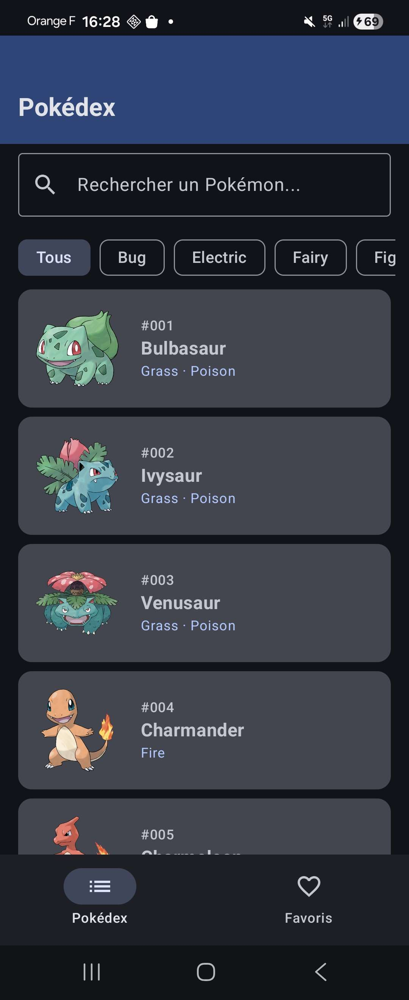
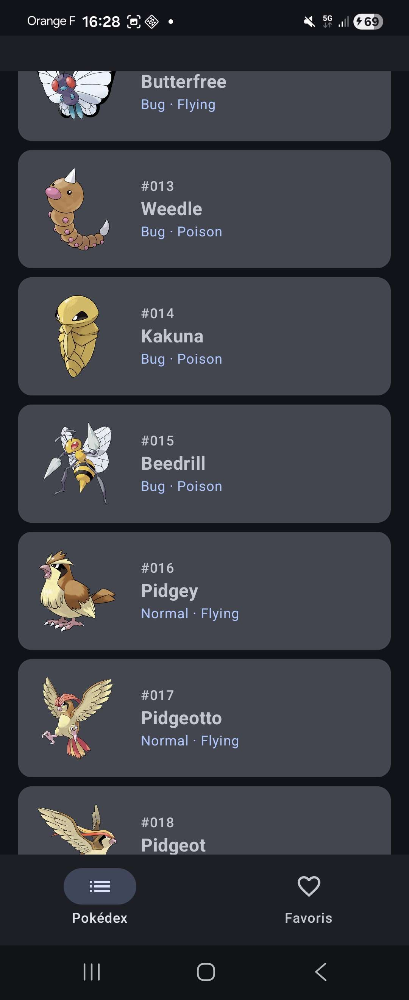
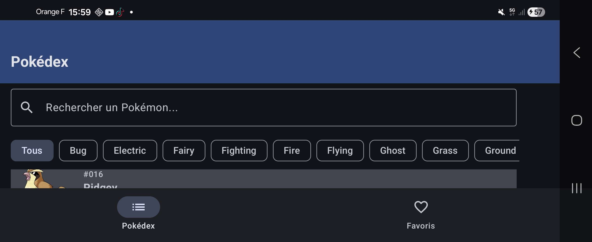
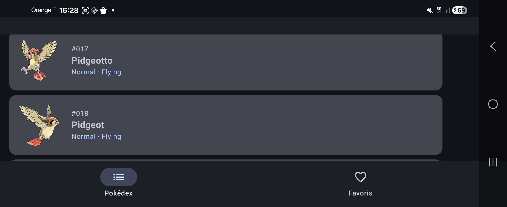
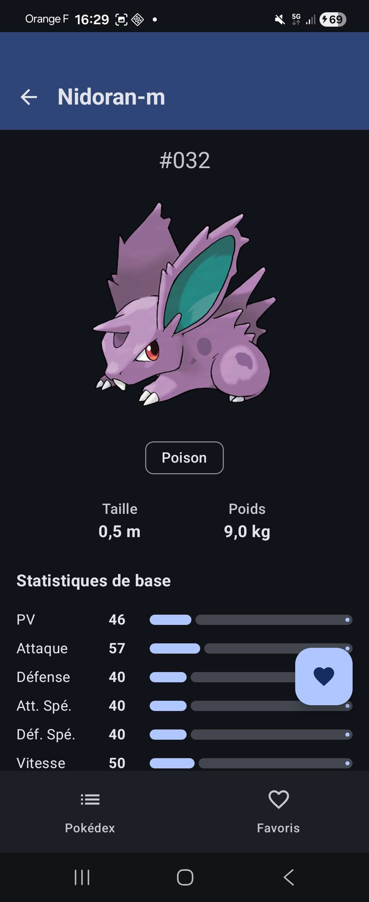
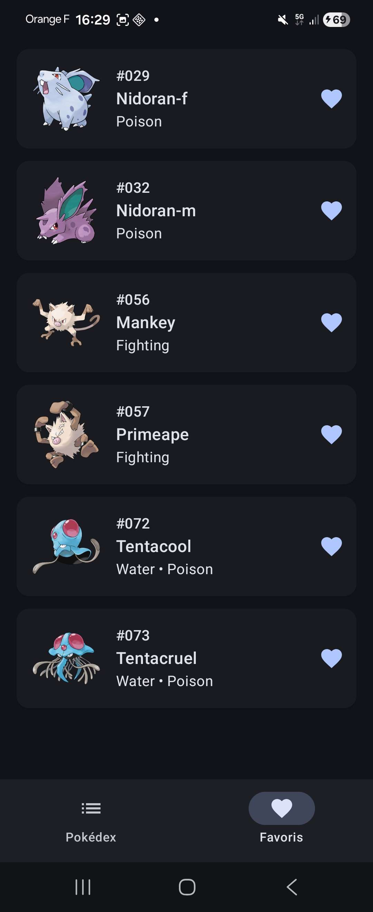

# PokéDex App — Atelier Développement Mobile (EPSI)

Application Android native en Kotlin consommant l'API publique [PokéAPI](https://pokeapi.co) pour afficher un Pokédex interactif avec gestion de favoris persistés localement.

> **Projet réalisé dans le cadre du cours de Développement Mobile à l'EPSI.**

---

## Sommaire

- [Fonctionnalités](#fonctionnalités)
- [Stack technique](#stack-technique)
- [Architecture](#architecture)
- [Structure du projet](#structure-du-projet)
- [Installation et lancement](#installation-et-lancement)
- [Captures d'écran](#captures-décran)
- [Difficultés rencontrées](#difficultés-rencontrées)
- [Auteur](#auteur)

---

## Fonctionnalités

- [x] Liste des 100 premiers Pokémons (sprite, numéro Pokédex, nom, types) chargée en parallèle via Coroutines
- [x] Filtrage local par nom (insensible à la casse) et par type via chips sélectionnables — aucun appel réseau supplémentaire
- [x] Fiche détaillée par Pokémon (sprite officiel, taille, poids, 6 stats avec barres de progression)
- [x] Ajout / retrait des favoris depuis la fiche détail (FAB avec icône qui change selon l'état)
- [x] Onglet Favoris persisté localement avec mise à jour réactive (Room + Flow)
- [x] Navigation par Bottom Navigation Bar (2 onglets) avec back stack indépendant par onglet
- [x] TopAppBar collapsable au scroll (UX optimisée pour le mode paysage)

---

## Stack technique

| Catégorie | Librairie | Rôle |
|---|---|---|
| **Langage** | Kotlin | Langage principal |
| **UI** | Jetpack Compose + Material 3 | Construction des écrans |
| **Architecture** | MVVM + Clean Architecture | Séparation des responsabilités |
| **DI** | Hilt | Injection de dépendances |
| **Réseau** | Retrofit + OkHttp + Logging Interceptor | Consommation de l'API REST |
| **Sérialisation** | Gson (ou Moshi) | Parsing JSON ↔ objets Kotlin |
| **Images** | Coil | Chargement asynchrone des sprites |
| **Base de données** | Room | Persistance des favoris |
| **Asynchrone** | Coroutines + Flow / StateFlow | Programmation réactive |
| **Navigation** | Jetpack Navigation Compose | Navigation entre écrans |

### Versions et environnement

- **Android Studio** : 2025.3.4 (Narwhal)
- **Android Gradle Plugin** : 8.7.3
- **Kotlin** : 2.0.21
- **KSP** : 2.0.21-1.0.28
- **Hilt** : 2.52
- **Room** : 2.6.1
- **Retrofit** : 2.11.0
- **Coil** : 2.7.0
- **Navigation Compose** : 2.8.5
- **Compose BOM** : 2024.12.01
- **Compile SDK** : 35
- **Min SDK** : 24 (Android 7.0 Nougat)
- **Target SDK** : 35
- **Java target** : 11

---

## Architecture

Le projet suit le pattern **MVVM** combiné à une **Clean Architecture** en 3 couches, comme imposé par le cahier des charges.

```
┌─────────────────────────────────────────┐
│           PRESENTATION (UI)             │
│   Composables + ViewModels + StateFlow  │
└──────────────────┬──────────────────────┘
                   │ observe
┌──────────────────▼──────────────────────┐
│              DOMAIN                     │
│   Models + Repository interfaces +      │
│              UseCases                   │
└──────────────────┬──────────────────────┘
                   │ implémenté par
┌──────────────────▼──────────────────────┐
│               DATA                      │
│   Retrofit API + Room DB + Repository   │
│             implementations             │
└─────────────────────────────────────────┘
```

### Choix architecturaux justifiés

- **MVVM** : séparation entre l'UI (Compose) et la logique de présentation (ViewModels). Permet aux ViewModels de survivre aux rotations d'écran et d'être testables sans le framework Android.
- **Clean Architecture** : la couche `domain` ne dépend d'aucun framework, ce qui la rend portable et facilement testable. Les `UseCases` encapsulent les règles métier réutilisables.
- **Repository pattern** : abstraction des sources de données (réseau + BDD locale). L'interface vit en `domain/`, l'implémentation en `data/`, permettant un swap facile (mock pour les tests, par exemple).
- **Hilt** : génère le code d'injection de dépendances à la compilation, plus performant que Dagger pur et bien intégré à Android.
- **StateFlow** : exposition d'états UI immuables et observables côté Compose, parfait pour le pattern unidirectionnel data flow.
- **Sealed class `UiState<T>`** : modélise explicitement les trois états possibles d'une opération asynchrone (Loading / Success / Error) et force l'UI à les gérer tous.

---

## Structure du projet

```
com.example.pokedex/
├── data/
│   ├── remote/        ← Retrofit API + DTOs
│   ├── local/         ← Room Entities, DAOs, Database
│   └── repository/    ← Implémentations des repositories
├── domain/
│   ├── model/         ← Modèles métier (Pokemon, PokemonDetail)
│   ├── repository/    ← Interfaces des repositories
│   └── usecase/       ← Use cases (GetPokemonListUseCase, ToggleFavoriteUseCase…)
├── presentation/
│   ├── list/          ← Écran liste Pokédex + ViewModel
│   ├── detail/        ← Fiche détail Pokémon + ViewModel
│   ├── favorites/     ← Liste favoris + ViewModel
│   └── navigation/    ← Configuration de la navigation
├── di/                ← Modules Hilt
└── ui/theme/          ← Thème Material 3
```

---

## Installation et lancement

### Prérequis
- Android Studio Narwhal (2025.3+) ou plus récent
- JDK 11 ou supérieur
- Un émulateur Android API 26+ ou un appareil physique en mode développeur

### Étapes

1. Cloner le dépôt :
   ```bash
   git clone <url-du-repo>
   cd "developpement mobile"
   ```
2. Ouvrir le dossier dans Android Studio.
3. Laisser Gradle synchroniser les dépendances (peut prendre quelques minutes au premier build).
4. Sélectionner un device/émulateur dans la barre du haut.
5. Cliquer sur **Run** (▶) ou `Shift + F10`.

### Build de l'APK debug

```bash
./gradlew assembleDebug
```

L'APK sera généré dans `app/build/outputs/apk/debug/app-debug.apk`.

Sous Windows, tu peux aussi utiliser le script racine :

```bat
build-apk.bat
```

Ce script lance uniquement `:app:assembleDebug` et ne déclenche aucun test.

Pour installer directement l'application sur un émulateur ou un appareil connecté :

```bat
install-apk.bat
```

Ce script lance uniquement `:app:installDebug` et ne déclenche aucun test.

---

## Captures d'écran

### Écran principal — onglet Pokédex

| En haut de la liste | Après scroll (TopAppBar + recherche collapsées) |
|---|---|
|  |  |

L'en-tête (barre de titre + champ de recherche + chips de filtre) **se replie automatiquement** dès que l'utilisateur scrolle vers le bas, et **réapparaît au moindre scroll vers le haut**. Le tout est piloté par `TopAppBarDefaults.enterAlwaysScrollBehavior()` couplé à `AnimatedVisibility` synchronisé sur la même `collapsedFraction`.

### Mode paysage — bénéfice maximal du collapse

| En haut | Après scroll |
|---|---|
|  |  |

En paysage, l'en-tête prenait initialement ~70 % de la hauteur. Après collapse, la liste occupe presque tout l'écran.

### Fiche détail + Favoris

| Fiche détail (avec bouton ❤️ favori) | Onglet Favoris |
|---|---|
|  |  |

La fiche détail montre le sprite officiel, les types, la taille (en mètres) et le poids (en kg) convertis depuis les unités brutes de PokéAPI, et les 6 stats de base avec barres de progression. Le **FAB** en bas à droite bascule l'état favori — l'icône passe de contour à plein, et le Pokémon apparaît instantanément dans l'onglet Favoris via le `Flow` Room réactif.

---

## Difficultés rencontrées

### 1. Incompatibilité AGP 9.x ↔ Hilt 2.x
Android Studio Narwhal (2025.3) installe par défaut **AGP 9.2.1**, qui a supprimé l'API interne `BaseExtension` utilisée par le plugin Gradle de Hilt. Conséquence : aucune version de Hilt (testées jusqu'à 2.57) ne parvient à s'appliquer, le build échouant avec `Android BaseExtension not found`.

**Solution** : downgrade contrôlé de la chaîne d'outils vers une combinaison stable et largement compatible — AGP **8.7.3** + Kotlin **2.0.21** + Hilt **2.52** + KSP **2.0.21-1.0.28**. Le `compileSdk` est passé de 36 à 35 pour rester aligné avec AGP 8.x.

### 2. Pollution de l'historique Git par l'installateur Android Studio
L'installeur `android-studio-panda4-patch1-windows.exe` (1.36 GB) s'est retrouvé commit lors du `git init` initial faute d'avoir été ajouté au `.gitignore`. Le `git push` initial a refusé d'avancer (GitHub limite les fichiers à 100 MB).

**Solution** : `git filter-branch --index-filter "git rm --cached --ignore-unmatch ..."` pour réécrire l'historique et purger le binaire de tous les commits, suivi de `git gc --prune=now --aggressive` pour libérer l'espace. Patterns `*.exe`, `*.msi`, `premiercours/` ajoutés au `.gitignore` pour éviter une rechute.

### 3. Coordination en binôme sans Pull Request
Le workflow choisi étant la fusion directe dans `main` sans PR, plusieurs ajustements ont dû être faits côté code à la phase d'intégration :
- Use cases favoris (`GetFavoritesUseCase`, `ToggleFavoriteUseCase`, `IsFavoriteUseCase`) initialement absents — ajoutés pendant l'intégration pour respecter la Clean Architecture.
- Refacto de `FavoritesViewModel` pour qu'il dépende d'un UseCase plutôt que directement du `FavoriteRepository`.
- L'en-tête de licence Apache 2.0 supprimé par mégarde du `gradlew.bat` a été restauré.

**Leçon** : même sans PR, communiquer les contrats domain en amont (interfaces, modèles) est crucial pour éviter les conflits d'intégration.

### 4. PokéAPI ne renvoie pas les types dans le endpoint liste
`GET /pokemon?limit=100` ne renvoie que `{ name, url }`. Impossible d'afficher les types et le sprite dans la liste sans un second appel par Pokémon.

**Solution** : 101 appels HTTP en parallèle via `coroutineScope { ... .map { async { api.getPokemonDetail(it) } }.awaitAll() }`. Le temps total reste équivalent à la requête la plus lente (~1-2 s) au lieu de la somme cumulée (~30 s en séquentiel).

### 5. TopAppBar trop encombrante en mode paysage
En paysage, l'en-tête Material 3 + champ de recherche + chips de type prenaient ~70 % de la hauteur, ne laissant visible qu'une ligne de Pokémon.

**Solution** : `TopAppBarDefaults.enterAlwaysScrollBehavior()` couplé à `Modifier.nestedScroll(...)` sur le Scaffold. La TopAppBar se replie automatiquement quand l'utilisateur scrolle vers le bas et réapparaît au scroll inverse. UX uniforme sur portrait et paysage.

### 6. Subtilité `runCatching` vs `Result` propre
`runCatching` de Kotlin capture toutes les exceptions, y compris `CancellationException` qui est le mécanisme interne d'annulation des coroutines. Capturer cette exception casse silencieusement l'annulation.

**Solution** : helper `safeApiCall` dans `PokemonRepositoryImpl` qui rejette explicitement `CancellationException` avant de wrapper les autres erreurs dans `Result.failure`.

---

## Auteurs

Projet réalisé en binôme :
- **Alexandre S.**
- **Pierre**

## Répartition des tâches

| Membre | Responsabilités |
|---|---|
| **Alexandre** | Couche réseau (Retrofit + PokéAPI), `data/remote`, `PokemonRepositoryImpl`, `NetworkModule` (Hilt), use cases liste/détail, écran liste Pokédex + filtres, écran détail Pokémon |
| **Pierre** | Base de données locale (Room), `data/local`, `FavoriteRepositoryImpl`, `DatabaseModule` + `RepositoryModule` (Hilt), use cases favoris, écran Favoris, navigation (Bottom Navigation Bar + NavGraphs), intégration `MainActivity` |

Les modèles métier (`domain/model/`), les interfaces de repository (`domain/repository/`) et la sealed class `UiState` ont été définis ensemble en amont pour garantir des contrats stables entre les deux côtés.

---

## Ressources utilisées

- [Documentation Android Developers](https://developer.android.com)
- [Guide d'architecture Android](https://developer.android.com/topic/architecture)
- [Documentation PokéAPI](https://pokeapi.co/docs/v2)
- [Documentation Retrofit](https://square.github.io/retrofit/)
- [Documentation Hilt](https://dagger.dev/hilt/)
- [Documentation Room](https://developer.android.com/training/data-storage/room)
- [Documentation Kotlin Coroutines](https://kotlinlang.org/docs/coroutines-overview.html)
- [Codelabs Android officiels](https://developer.android.com/codelabs)
